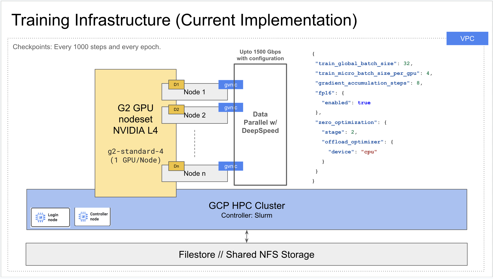

# Small GPT-2 model training on GCP HPC Cluster using DeepSpeed and Slurm controller.

## Architecture



## Setup

Follow these steps to set up the environment and deploy the initial cluster:

1.  **Set Project ID:** Define your Google Cloud project ID.
    ```bash
    export project_id=<Your GCP ProjectId>
    ```

2.  **Clone and Build HPC Toolkit:**
    ```bash
    git clone https://github.com/GoogleCloudPlatform/cluster-toolkit.git
    cd cluster-toolkit/
    make
    # Verify build
    ./gcluster --version 
    # Go back to the parent directory or your workspace root
    cd .. 
    ```

3.  **Clone Project Repository:**
    ```bash
    git clone https://github.com/solanki-ravi/gpt2-hpc-demo.git
    cd gpt2-hpc-demo
    ```

4.  **Create Cluster Deployment Directory:** (Ensure you are inside the `gp2demo` directory)
    ```bash
    # The ./gcluster command assumes you are running from the gpt2-hpc-demo directory
    # and the cluster-toolkit repo (containing gcluster) is one level up.
    # Adjust the path to gcluster if necessary.
    ../cluster-toolkit/gcluster create hpc-slurm.yaml \
        -l ERROR --vars project_id=$project_id
    ```

5.  **Deploy Cluster Resources:** (Replace deployment name if different from blueprint)
    ```bash
    ../cluster-toolkit/gcluster deploy hpc-slurm-gpt2demo-gpu-g2-deepspeed
    ```

This project contains scripts to train a GPT-2 language model using DeepSpeed for efficient distributed training on a Slurm cluster managed by the Google Cloud HPC Toolkit.

For more information about GCP HPC Clusters, please refer to: https://cloud.google.com/solutions/hpc?hl=en
For a tutorial on GCP HPC Cluster with Slurm, please refer to: https://codelabs.developers.google.com/codelabs/hpc-slurm-on-gcp#0

For information on the training architecture, please refer to the following diagram.

The model was trained on 8 g2-standard-4 cluster instances (NVIDIA L4s). More information on GCP G4 instances can be found here: https://cloud.google.com/compute/docs/gpus/#l4-gpus

The model could easily be launched on more powerful H{1|2}00 instances on GCP, by defiing the appropriate node configuration (hpc-slurm.yaml).

## Files

*   `train.py`: The main Python script for loading data, configuring the model, and running the training loop using DeepSpeed.
*   `run_llm.slurm`: The Slurm batch script used to submit the training job. It sets up the environment and launches `train.py` using `srun` and `torchrun`.
*   `deepspeed_config.json`: Configuration file for DeepSpeed, specifying settings like batch sizes, gradient accumulation, FP16, and ZeRO optimization stages.
*   `requirements.txt`: Lists the required Python packages.
*   `hpc-slurm.yaml`: The HPC Toolkit blueprint defining the Slurm cluster infrastructure (nodesets, partitions, controller, etc.).

## Prerequisites

1.  **HPC Cluster:** A Slurm cluster deployed using the HPC Toolkit (based on `hpc-slurm.yaml`).
2.  **Shared Filesystem:** A shared filesystem (like NFS or Filestore, defined as `homefs` in `hpc-slurm.yaml`) mounted at `/home` (or adjusted paths in scripts) accessible by the login node and compute nodes.
3.  **Code:** Clone or copy this project directory to the shared filesystem.
4.  **System Dependencies on Compute Nodes:** The compute nodes in the target partition (e.g., `g2gpu`) need the following system packages installed (using `sudo dnf install -y ...` on Rocky Linux 8):
    *   `ninja-build`
    *   `python38-devel` (or the version matching the Python used)
    *   `"Development Tools"` package group (for `g++`, `make`)
    *   `gcc-toolset-12` (or the version required by the PyTorch/DeepSpeed build)
    *(Manual installation via SSH is currently required as per the setup steps)*
5.  **Python Dependencies:** Install the Python packages on the login node (and potentially within the job using the script) in your user environment:
    ```bash
    pip3 install --user -r requirements.txt
    ```

## Running the Training Job

The training job is submitted using the `run_llm.slurm` script.

```bash
sbatch run_llm.slurm
```

### Configuration

You can configure the training run by setting environment variables when submitting the job using `sbatch --export=...`.

*   **`EPOCHS`**: Number of training epochs.
    *   Default: `10`
    *   Example: `sbatch --export=ALL,EPOCHS=5 run_llm.slurm`
*   **`CHECKPOINT_DIR`**: Directory path where DeepSpeed checkpoints will be saved. This should be on the shared filesystem.
    *   Default: `./my_gpt2_checkpoint` (relative to where `sbatch` is run)
    *   Example: `sbatch --export=ALL,CHECKPOINT_DIR="/home/user/gpt2_run1/checkpoints" run_llm.slurm`
*   **`DATA_PERCENTAGE`**: Percentage of the "openwebtext" training split to use.
    *   Default: `10` (meaning 10%)
    *   Example: `sbatch --export=ALL,DATA_PERCENTAGE=50 run_llm.slurm`

You can combine these flags:

```bash
sbatch --export=ALL,EPOCHS=3,DATA_PERCENTAGE=25,CHECKPOINT_DIR="/fsx/my_training_run" run_llm.slurm
```

*(Note: The requirement for `ALL` in `--export=ALL,...` depends on your specific Slurm configuration regarding environment variable propagation.)*

## Monitoring

*   Check job status: `squeue -u $USER`
*   Check output: `cat slurm-<job_id>.out`
*   Check errors: `cat slurm-<job_id>.err`

## Inference (`inference.py`)

An `inference.py` script is provided to load a trained DeepSpeed checkpoint and generate text based on a prompt.

**Prerequisites:**

*   Ensure Python dependencies are installed (`pip3 install --user -r requirements.txt`).
*   Have access to a saved DeepSpeed checkpoint directory (e.g., `./my_gpt2_checkpoint/global_step65110`).
*   Ensure `deepspeed_config.json` used during training is present in the current directory (as the inference script uses it to initialize the model engine structure for loading).
*   If running on GPU, ensure drivers and CUDA are set up.
*   If using DeepSpeed CPUAdam/Offloading during training, the inference environment might still need build tools (`ninja-build`, `python38-devel`, `gcc-toolset-12`) installed, although inference is often done without DeepSpeed optimizations active.

**Usage:**

```bash
python3 inference.py <path_to_checkpoint_tag_directory> [options]
```

**Arguments:**

*   `checkpoint_dir` (Positional): The full path to the *specific checkpoint tag directory* you want to load (e.g., `./my_gpt2_checkpoint/global_step65110`).
*   `--prompt` (Optional): The starting text prompt. Remember to use quotes if the prompt contains spaces.
    *   Default: `"DeepSpeed is"`
*   `--model_name` (Optional): Base model name for loading the tokenizer.
    *   Default: `gpt2`
*   `--device` (Optional): Device to run on (`cuda:0`, `cpu`, etc.).
    *   Default: `cuda:0` if available, else `cpu`.
*   `--max_new_tokens` (Optional): Max number of tokens to generate after the prompt.
    *   Default: `50`

**Examples:**

```bash
# Run with default prompt ("DeepSpeed is")
python3 inference.py my_gpt2_checkpoint/global_step65110

# Run with a custom prompt
python3 inference.py my_gpt2_checkpoint/epoch_end_1 --prompt "The future of AI is"
```

This command will load the specified checkpoint, initialize the DeepSpeed engine using `deepspeed_config.json`, generate text based on the prompt, and print the result.

## Cluster Management Script (`manage_cluster.sh`)

A helper script `manage_cluster.sh` is provided to simplify creating and destroying the cluster using the HPC Toolkit (`gcluster` command).

**Prerequisites:**

*   Ensure the `gcluster` executable (built from the HPC Toolkit repo) is in your current directory or PATH.
*   Ensure the blueprint file (`hpc-slurm.yaml`) is in the current directory.
*   Make the script executable:
    ```bash
    chmod +x manage_cluster.sh
    ```
*   Set your Google Cloud Project ID as an environment variable:
    ```bash
    export PROJECT_ID="your-gcp-project-id"
    ```

**Usage:**

*   **Create Deployment Directory:**
    ```bash
    ./manage_cluster.sh create <your_deployment_name>
    ```
    *(Replace `<your_deployment_name>` with the `deployment_name` from `hpc-slurm.yaml`, e.g., `hpc-slurm-gpt2demo-gpu-g2-deepspeed`)*

*   **Deploy Cluster Resources:**
    ```bash
    ./manage_cluster.sh deploy <your_deployment_name>
    ```

*   **Destroy Cluster:**
    ```bash
    # Without auto-approve (will prompt)
    ./manage_cluster.sh destroy <your_deployment_name>

    # With auto-approve
    ./manage_cluster.sh destroy <your_deployment_name> --auto-approve
    ```
    *(Replace `<your_deployment_name>` accordingly)*

## Running on a Multi-GPU Node

The current configuration requests and assumes a single GPU per node (`g2-standard-4`). To run on a node with multiple GPUs (e.g., an `a2-highgpu-4g` with 4 GPUs), you need to make the following adjustments:

1.  **Modify `hpc-slurm.yaml`:**
    *   Change the `machine_type` for the relevant nodeset (e.g., `g2_gpu_nodeset`) to a multi-GPU instance type (e.g., `a2-highgpu-4g`).
    *   Redeploy the cluster infrastructure using the HPC Toolkit (`./gcluster deploy ...`) for the change to take effect.

2.  **Modify `run_llm.slurm`:**
    *   Update the SBATCH directive to request the correct number of GPUs per node. For example, for a 4-GPU node:
        ```bash
        #SBATCH --gpus-per-node=4
        ```
    *   You might need to remove or adjust the `#SBATCH --gres=gpu:1` line if present and conflicting.
    *   The rest of the script (`srun ... --nproc_per_node $SLURM_GPUS_PER_NODE ...`) should automatically adapt because `$SLURM_GPUS_PER_NODE` will be set by Slurm based on your `--gpus-per-node` request.

3.  **Modify `deepspeed_config.json` (Optional but Recommended):**
    *   To maintain the same *global batch size* and training dynamics, you usually need to adjust `gradient_accumulation_steps`.
    *   The relationship is: `global_batch_size = micro_batch_per_gpu * num_gpus * gradient_accumulation_steps`.
    *   If you change the number of GPUs (`num_gpus`) but want to keep `global_batch_size` and `micro_batch_per_gpu` the same, calculate the new `gradient_accumulation_steps`.
    *   *Example:* If the original config was `micro_batch=2`, `num_gpus=1`, `accum=16` (Global=32), and you switch to `num_gpus=4`, the new accumulation steps should be `32 / (2 * 4) = 4`.
        ```json
        {
          "train_global_batch_size": 32,
          "train_micro_batch_size_per_gpu": 2, 
          "gradient_accumulation_steps": 4, // Adjusted for 4 GPUs
          ...
        }
        ```
    *   If you don't adjust this, your global batch size will increase proportionally to the number of GPUs.
   
## Optimizations to Maximize MFU (Model Flops Utilization)

Maximizing MFU means getting the most computational throughput from your GPUs. Here are key areas to optimize:

1.  **Tune Micro-Batch Size (`train_micro_batch_size_per_gpu`):**
    *   This is often the most impactful parameter for MFU.
    *   Find the largest micro-batch size that fits into your GPU memory (e.g., 22GB on L4) without causing Out-Of-Memory (OOM) errors. Monitor GPU memory using `nvidia-smi` during training.
    *   Increase this value incrementally (e.g., from 2 to 4, maybe 6) in `deepspeed_config.json`.
    *   Remember to **decrease** `gradient_accumulation_steps` proportionally to maintain the desired `train_global_batch_size`.
    *   You also need to **match** the `BATCH_SIZE` variable in `train.py` to the chosen `train_micro_batch_size_per_gpu`.

2.  **Leverage Mixed Precision (FP16/BF16):**
    *   FP16 is enabled (`"fp16": {"enabled": true}`) in the current `deepspeed_config.json` and is crucial for performance on L4 GPUs (utilizes Tensor Cores).
    *   If you encounter numerical stability issues (NaN loss), consider fine-tuning FP16 loss scaling parameters in the DeepSpeed config or switching to BF16 (if supported and desired).

3.  **Optimize Data Pipeline (`DataLoader` in `train.py`):**
    *   Increase `num_workers` in the `DataLoader` (e.g., `num_workers=4` or `8`) to load data in parallel using CPU processes, preventing the GPU from waiting.
    *   Add `pin_memory=True` to the `DataLoader` arguments to speed up CPU-to-GPU data transfers.

4.  **Consider Activation Checkpointing:**
    *   If memory limits prevent further increases in micro-batch size, use activation checkpointing (gradient checkpointing).
    *   This trades increased computation (recalculating activations during backward pass) for significantly lower memory usage, potentially allowing larger batches and higher MFU.
    *   Configure this in `deepspeed_config.json` (refer to DeepSpeed documentation for details).

5.  **Utilize Fused Kernels (Requires Build Tools):**
    *   DeepSpeed offers optimized CUDA kernels (e.g., FusedAdam) that can improve performance by reducing kernel launch overhead.
    *   These often require compiling C++ extensions during initialization.
    *   If you have successfully installed all build prerequisites on compute nodes (`ninja-build`, `python38-devel`, correct `gcc` version via `scl enable`), DeepSpeed may automatically use these when applicable (e.g., with FP16 enabled).

6.  **High-Bandwidth Networking (gVNIC):**
    *   Google Virtual NIC (gVNIC) provides higher network bandwidth compared to the default VirtIO-Net, crucial for efficient gradient synchronization (all-reduce) in multi-node training.
    *   Your `hpc-slurm.yaml` already enables this for the `g2_gpu_nodeset` via `bandwidth_tier: gvnic_enabled`.

7.  **Diagnose Communication with `NCCL_DEBUG`:**
    *   If you suspect networking or inter-GPU communication bottlenecks (especially in multi-node setups), use NCCL debugging.
    *   Export the environment variable in your `run_llm.slurm` script *before* the `srun` command:
        ```bash
        export NCCL_DEBUG=INFO 
        # (or NCCL_DEBUG=WARN for less verbose output)
        scl enable gcc-toolset-12 -- \
        srun --label python3 ...
        ```
    *   This will print detailed information about NCCL operations (initialization, communicator setup, data transfers) to the job's output/error files, helping identify communication issues.

## Author / Contact:
Ravi Solanki: github.com/solanki-ravi
